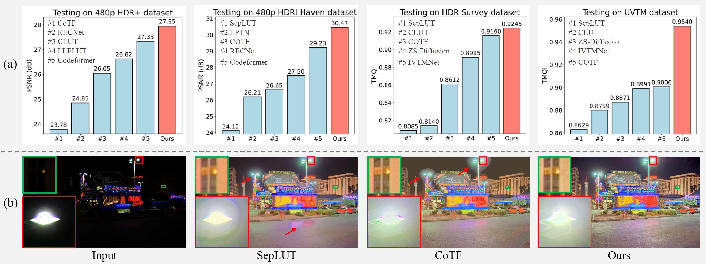

<div align="center">
  <h1 align="center">Learning Differential Pyramid Representation for Tone Mapping (DPRNet) — NeurIPS 2025</h1>

  <p align="center">
    <b>
      Qirui Yang<sup>1</sup>, Yinbo Li<sup>1</sup>, Yihao Liu<sup>2</sup>,
      Peng-Tao Jiang<sup>3</sup>, <br>
      Fangpu Zhang<sup>1</sup>, Qihua Cheng, Huanjing Yue<sup>1</sup>, Jingyu Yang<sup>1†</sup>
    </b><br>
    <sup>1</sup> Tianjin University &nbsp;&nbsp;&nbsp;
    <sup>2</sup> Shanghai Artificial Intelligence Laboratory<br>
    <sup>3</sup> vivo Mobile Communication Co., Ltd.<br>
    <sup>†</sup> Corresponding author
  </p>

  [](https://xxxxxxdprnet.github.io/DPRNet/)
  [](https://arxiv.org/abs/2412.01463)
  [](https://opensource.org/license/MIT)
 

  <strong><i>DPRNet </i> is an end-to-end tone mapping framework for high-fidelity HDR-to-LDR conversion that tackles detail loss and tone inconsistency in complex HDR scenes.</strong>

  <div style="width: 100%; text-align: center; margin:auto;">
      
  </div>
</div>


## 🔥 Highlights

- **Learnable Differential Pyramid**: a content-aware, learnable differential pyramid that generalizes Laplacian & DoG pyramids via adaptive differencing across scales.
- **Global + Local Tone Modeling**: global tone perception + local tone tuning modules jointly model global tone consistency and local contrast enhancement.
- **Iterative Detail Enhancement**: progressive coarse-to-fine refinement to restore full-resolution details and structure.
- **SOTA Performance**: +2.39 dB PSNR on **4K HDR+**, +3.01 dB on **4K HDRI Haven**.


## 📝 Abstract

Existing tone mapping methods often operate on downsampled inputs and rely on handcrafted pyramids to recover high-frequency details. These designs typically fail to preserve fine textures and structural fidelity in complex HDR scenes. Furthermore, most methods lack an effective mechanism to jointly model **global tone consistency** and **local contrast enhancement**, which can lead to globally flat results or locally inconsistent outputs (e.g., halo artifacts).

We propose **DPRNet**, an end-to-end framework that introduces a **learnable differential pyramid** generalizing Laplacian and Difference-of-Gaussian (DoG) pyramids through **content-aware differencing across scales**, enabling adaptive capture of high-frequency variations under diverse luminance/contrast conditions. DPRNet further integrates **global tone perception** and **local tone tuning** modules operating on downsampled inputs for efficient yet expressive tone adaptation. Finally, an **iterative detail enhancement** module progressively restores full-resolution outputs in a coarse-to-fine manner, reinforcing structure and sharpness.


## 📦 Dataset: HDRI Haven 

The paper introduces a new dataset **HDRI Haven**, available via Baidu Netdisk:

- **Baidu Netdisk:** [Download HDRI Haven](https://pan.baidu.com/s/1i4n9OOvzud84vfc4wVBtXQ)
- **Extraction code:** `srly`


## 🧩 Pretrained Weights

Pretrained training weights can be downloaded via Baidu Netdisk:

- **Baidu Netdisk:** [Download pretrained weights](https://pan.baidu.com/s/1ZSM891Hu15ujV9HOnPnnDA)
- **Extraction code:** `64ou`


## 🏋️ Training

Run training with the provided config:

```bash
python train.py -opt options/train/train_DPRNet_hdrplus4k.yml
```


## 🧪 Testing

Run testing with the provided config:

```bash
python test_DPRNet.py -opt options/test/test_DPRNet_hdrplus4k.yml
```

## 📄 Citation

If you find this work useful, please cite:

```bibtex
@article{yang2024learning,
  title={Learning differential pyramid representation for tone mapping},
  author={Yang, Qirui and Li, Yinbo and Liu, Yihao and Jiang, Peng-Tao and Zhang, Fangpu and Cheng, Qihua and Yue, Huanjing and Yang, Jingyu},
  journal={arXiv preprint arXiv:2412.01463},
  year={2024}
}


